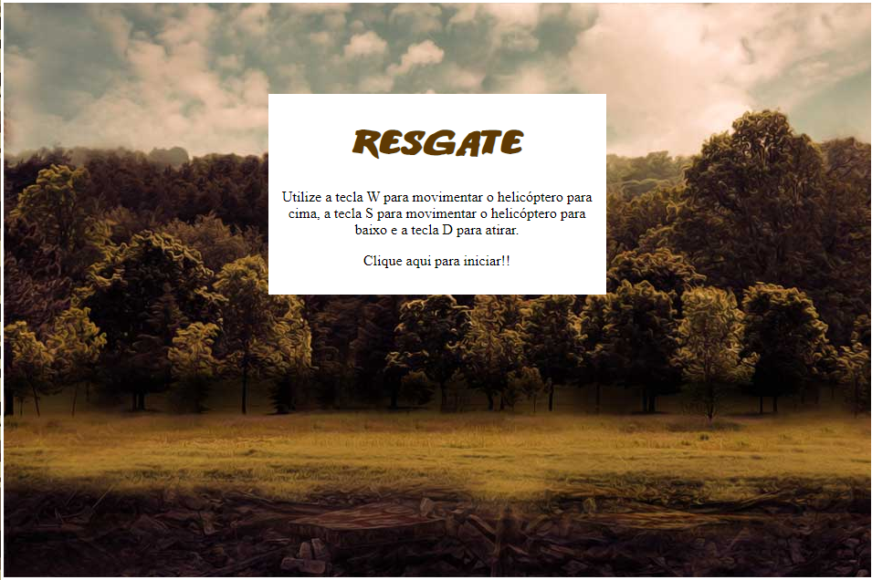
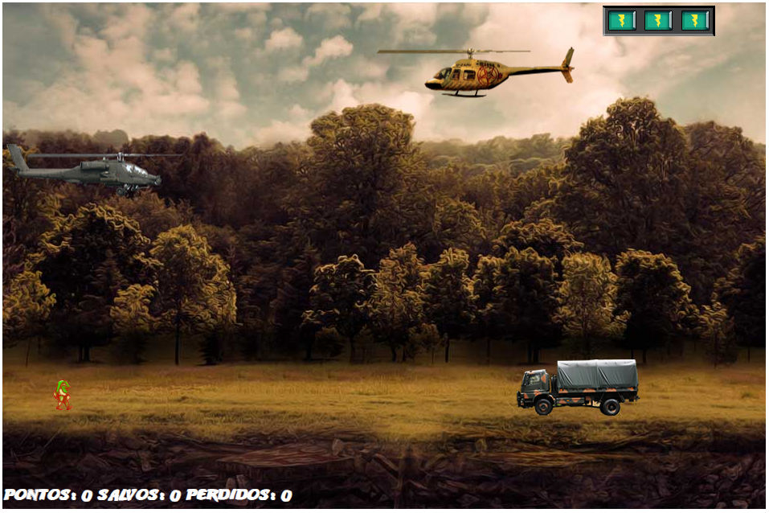
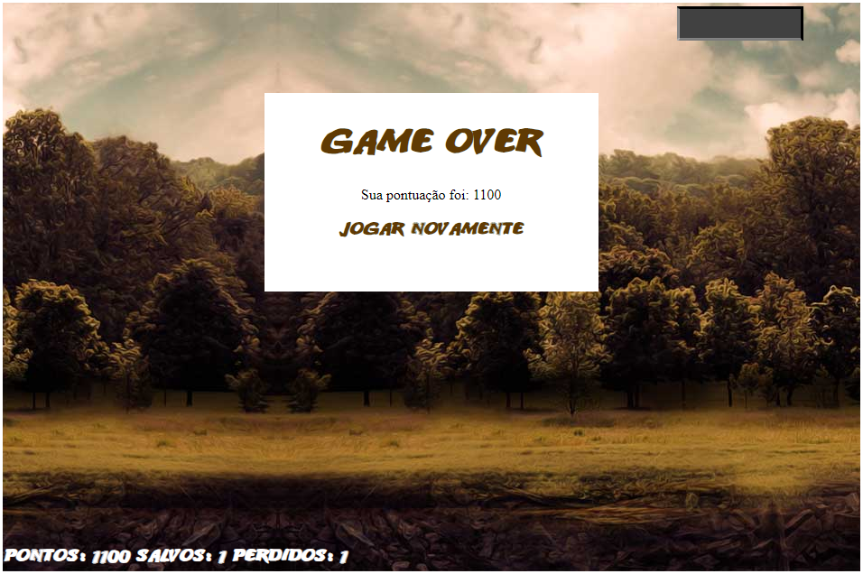

# README.md

## 🚀 Introdução

Meu primeiro jogo de naves:

Atividade feita como pré-requisito para a conclusão do Bootcamp 'Take Blip Web Developer' dispobilizado pela plataforma de ensino [Digital Innovation One](https://www.dio.me).

As ferramentas utilizadas foram HTML5, CSS3, JavaScript (ECMAScript6) e os frameworks jQuery e jQuery Collision.

## 🚁 Sobre o Jogo

Jogo 2D, em que o usuário poderá controlar o helicóptero para cima (apertando W) e para baixo (apertando S) (havendo um limite para as extremidades da janela do jogo), além de atirar nos inimigos (apertando D) e resgatar os amigos (movendo seu helicóptero até ele).

Além disso, o jogo possue 3 vidas, em que, se o usuário perder as 3 vidas, o jogo irá acabar e mostrará sua pontuação.

Os testes foram feitos nos navegadores: Google Chrome, Microsoft Edge e OperaGX.

## 🛠️ Conteúdo Original

O conteúdo original poderá ser visto no Bootcamp: Take Blip Web Developer na plataforma [Digital Innovation One](https://www.dio.me).

## 💬 OFF Topic

Nas próximas semanas irei melhorar aos poucos o código, sua indentação, além de dar uma nova roupagem para o jogo.

## ❤️ Espero que gostem!

Esse é o meu perfil no [LinkedIn](https://www.linkedin.com/in/rubens-fs/), se você quiser me seguir, eu agradeço! 😃

Além do LinkedIn, minhas outras redes sociais são:

- [Instagram](https://www.instagram.com/rubensfs_/)
- [Twitter](https://twitter.com/rubensfs_)